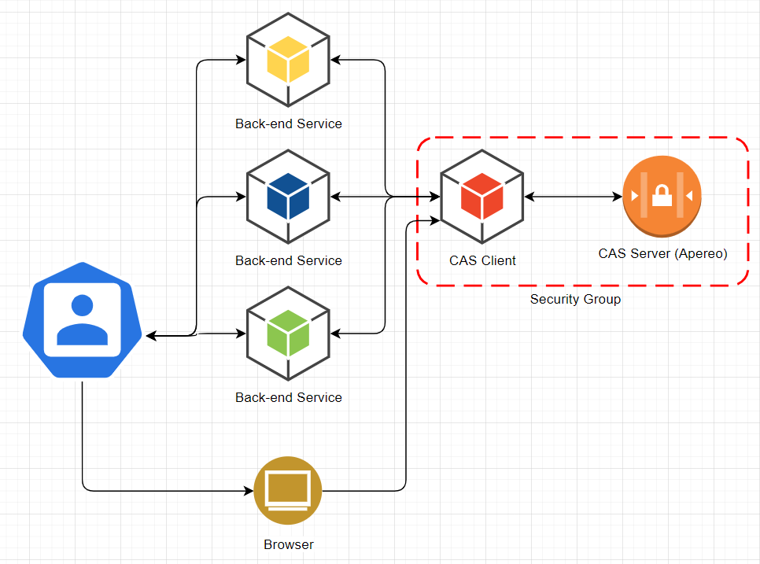

# Apereo Client Service
Spring boot middle-man service that connects non-spring applications and other services to Central Authentication Service (CAS) implemented by Apereo<br>

## Objectives
To ease security requirements on individual applications or services by providing a convinient interface for authentication via REST endpoints or browser interactions.

## API

---
<b><i>Find out more about the JSON schema below</i></b><br>
Each REST endpoint starts with "/oidc-spring/api/v1". Marked with:
- <b>(P-r : <i>X:X</i>)</b> - parameter, marked with "-r" is <b>required</b>, followed by the parameter "type" and "name" to the request<br>
  Example: (P-r : <i>Boolean:jwt</i>) - means that the request expect a required url parameter with the name of "jwt" which only accepts "true" or "false" as values.
- <b>(B : type)</b> - body of the request, the type of the body will have its json schema explained in the next section.
- <b>(A : type)</b> - an authorization header with specific type
---

- "/login"
    - POST - <b>(P : Boolean:jwt) (B : LoginBindingEntity)</b>
        - (jwt = false/missing) Returns a JSON AccessTokenResponseEntity Object (schema in section below) (contains the accessToken)
        - (jwt = true) Returns a signed JWT String

- /profile
    - GET - <b>(A : accessToken) (P : Boolean:jwt)</b>
        - (jwt = false/missing) Returns a String of unformated user data.
        - (jwt = true) Returns a signed JWT String

- /access
    - /accessToken - GET <b>(A : accessToken) (P-r : String:groups)</b>
    - /jwt - GET <b>(A : signed JWT) (P-r : String:groups)</b>

  <b>Both of the above endpoints:</b> Returns "true" whenever any of the provided groups in the request parameter are assigned to the authenticated user. The string of groups follows the schema: <br>
  "LO=lorem,IP=ipsum,XX=yyy" - can have only one or multiple groups.

# JSON Schemas

## LoginBindingEntity

```json
{
    "username": "",
    "password": ""
}
```

## AccessTokenResponseEntity
```json
{
    "access_token": "LOREM-IPSUM",
    "token_type": "bearer",
    "expires_in": 100000,
    "scope": ""
}
```

# NON-API Endpoints / Browser Access
As an interface (with the use of Thyemeleaf allowing direct interaction), the service is able to provide 
SSO & SLO (Single-Sign On and Single-Log Out) with Apereo CAS provider.

---
<b>Note:</b> When a CAS session ends, it notifies each of the services that the SSO session is no longer valid, 
and that relying parties need to invalidate their own session. Remember that the callback submitted to 
each CAS-protected application is a notification; nothing more. It is the responsibility of the application
to intercept that notification and properly destroy the user authentication session, either manually, via
a specific endpoint or more commonly via a CAS client library that supports SLO.
---

## Reaching the service
The homepage can be found at "/oidc-spring". It offers the user the ability to log in. After successful log in it will display user information and allow logging out.

## Big Picture


## Profiles

- "test" - enables Swagger functionality (Swagger is disabled by default)
- 